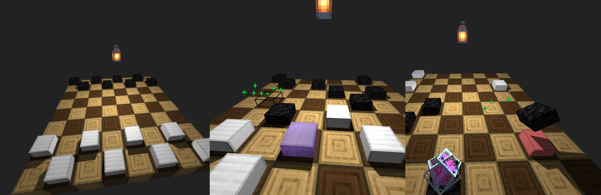
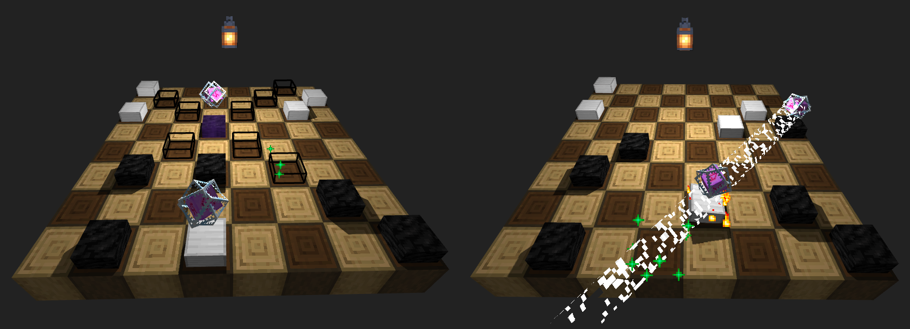

# Warcaby - browser, multiplayer checkers in 3D

###### It supposed to be a simple school project, but I took it into next level.

-   3D graphic in browser
-   2 players gameplay
-   **Three.js** on the Front-end
-   **Node.js** on the Back-end
-   Everything written in **Typescript** - single codebase
-   Impossible to cheat, game logic is a deterministic algorithm that runs on the server and clients

### Some screenshots




#### [See video](about.mp4)

###### Textures are not mine, they belong to Minecraft.

## Set up

### Requirements:

-   Node.js (tested on 15.12.0) with npm installed

##### Starting the server

```
node --experimental-specifier-resolution=node static/js/server.js
```

###### Now open http://localhost:8002 on you computer or http://&lt;your-local-ip&gt;:8002 if you open on different computer.

#### Compiling changes

```
npm i # only first time
tsc
```

###### Remember to restart the server after any change that affects either server or shared code.
